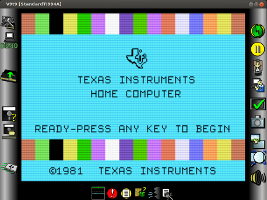

 
Introduction
============

<a href='images/v9t9-window.png'>
</img>
</a>

V9t9 emulates the TI-99/4A (by default) though it can support other
machines -- only made-up ones for now, using much of the same hardware.

History
-------- 

I've been working on this in various forms since 1992.  The Java port
was quite nastily ported directly from the C port starting 2005.  The C
port never really saw the light of day (it was a bit way too geeky for
the average user to understand, and only built against GNU C in Linux
and Metrowerks Codewarrior in Windows).  The C port was written from 
the assembly port which formed the original V9t9, back when it was 
still being sold.

Running
========

Setup
-----

Have Java 6 or newer installed on your system.  (The "Using Web Start" section may 
assist with this.)

You will need ROMs to actually use the emulator.  I don't provide these but 
**[this page](v9t9-roms.html)** will give you some instructions.

Installing Locally
--------------------

<a href="data/v9t9.zip">V9t9.zip</a>

<i>Download</i>

Download the archive to the right and unzip it somewhere on your system.

Then launch it by double-clicking the `v9t9-local.jnlp` file in your favorite operating system 
(though only Linux and Windows have been tested so far).

Or, if your Java isn't installed properly, try:

    $ cd /path/to/v9t9
    $ javaws v9t9-local.jnlp

(or the equivalent in Windows)

Using Web Start
--------------------

<noscript>This page requires JavaScript.</noscript>

<i>Launch</i>

Click on the button to the right.  This will fetch the most recent V9t9 build each time you use it.

Contact
=======

I'm currently in a trial run with this and haven't made the repository hosting V9t9 public.  
(Mainly, the sources are a bit messy and have no license headers yet.)

If you have questions or issues, please contact me at ed.swartz.twofiftyeight@gmail.com, but
use a number instead of spelling it out like that.

License
=======

This software includes content licensed under [EPL v1.0](http://www.eclipse.org/legal/epl-v10.html) 
and code from [the Base64 library](http://iharder.net/base64) and 
[Vlad Roubtsov's HRTimer library](http://www.javaworld.com/javaworld/javaqa/2003-01/01-qa-0110-timing.html).

Last updated:  {{site.time}}

